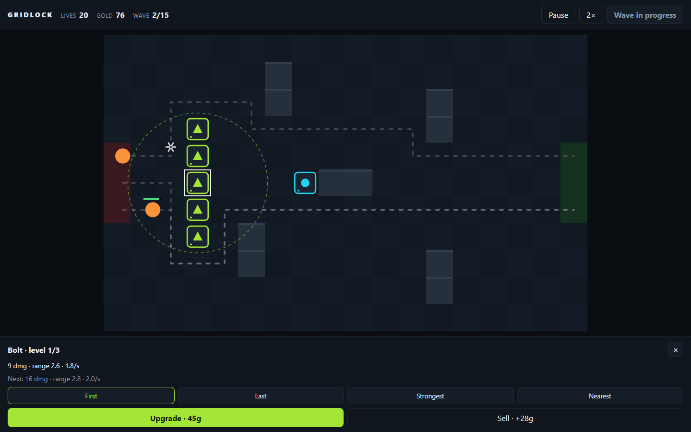
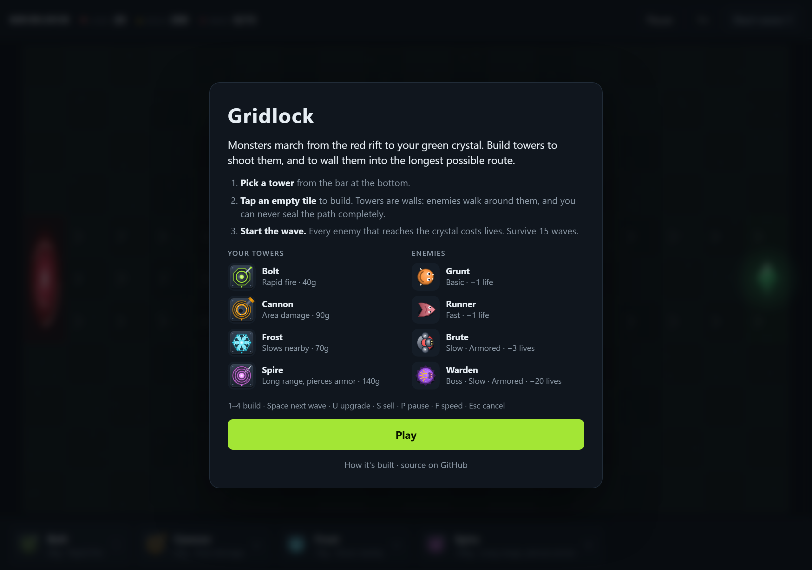
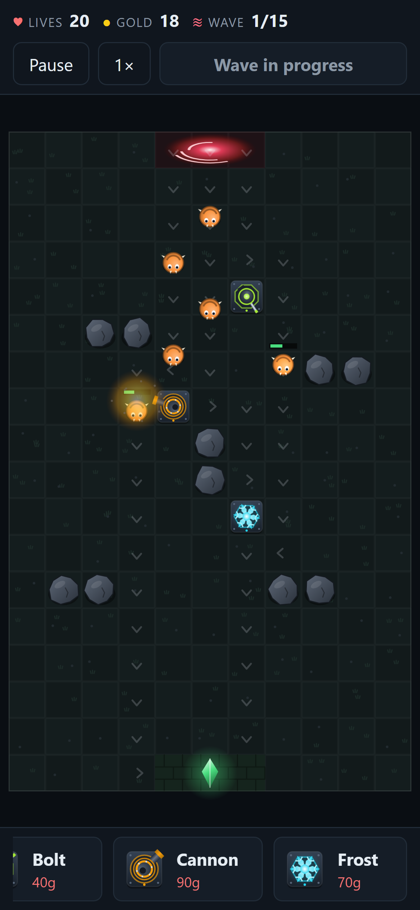
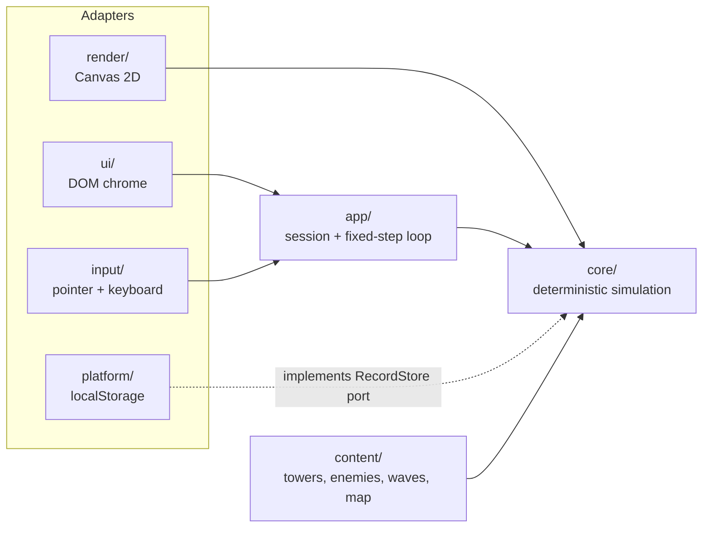

# Gridlock

[](https://github.com/celilcecen/towerdefence/actions/workflows/ci.yml)
[](https://github.com/celilcecen/towerdefence/actions/workflows/codeql.yml)

A maze-building tower defense game for the browser.

**▶ Play it: [play.yctechnologies.com.tr](https://play.yctechnologies.com.tr)**



<table>
  <tr>
    <td width="68%"></td>
    <td width="32%"></td>
  </tr>
  <tr>
    <td align="center">Start screen: rules and a visual legend drawn by the game's own renderer</td>
    <td align="center">On phones the board rotates for bigger tap targets</td>
  </tr>
</table>

Your towers are the walls. Enemies always take the shortest open route to the exit, so every
tower you place reshapes the maze they have to walk. You can never seal the path completely;
the game checks every placement before accepting it. Hold 15 waves across four tower types,
three upgrade levels and four targeting strategies. And you are on the field too: the Sentinel
runs the maze you build, fires at anything in reach, dashes through gaps and unleashes a crystal
Nova when charged. Works with mouse, keyboard and touch (a virtual stick on phones).

## At a glance

|                      |                                                                                    |
| -------------------- | ---------------------------------------------------------------------------------- |
| Runtime dependencies | **0**. TypeScript, Canvas 2D and the DOM only                                      |
| Unit tests           | **275**, with **99% statement / 96% branch** coverage of all game logic            |
| End-to-end tests     | **26**. Playwright on desktop and mobile Chromium, under the production CSP        |
| Art assets           | **0 files**. Every tower, enemy and effect is drawn in code and cached as a sprite |
| Balance guardrails   | Headless bots play the full campaign on 8 seeds in CI                              |
| Static analysis      | `strictTypeChecked` ESLint, strictest TypeScript flags, CodeQL `security-extended` |
| Delivery             | GitHub Actions pinned to commit SHAs, atomic releases with instant rollback        |

## Architecture

The rules of the game are a **pure, deterministic simulation** with no knowledge of the
browser. Everything that touches the outside world (canvas, DOM, input, storage, time) is an
adapter around it.



Arrows point from a module to what it depends on. Nothing depends on an adapter except the
composition root, [`src/app/main.ts`](src/app/main.ts). The dependency rule is **enforced, not
documented**: `src/core` and `src/content` compile against a tsconfig **without the DOM library**,
and ESLint rejects imports from adapter folders as well as `Math.random` or `Date.now` inside
the core.

### How a tick works

1. The browser loop ([`game-loop.ts`](src/app/game-loop.ts)) accumulates real time and runs
   whole ticks of exactly 1/30 s, independent of display refresh rate.
2. Player intent arrives as serialisable [commands](src/core/commands.ts) (`placeTower`,
   `upgradeTower`, `sellTower`, `setTargeting`, `startWave`, `castPower`, `moveHero`,
   `heroDash`, `heroNova`), validated at runtime. Even the hero's stick input is a command, so
   a replay log reproduces a whole game, hero and all.
3. [`Simulation.step()`](src/core/simulation.ts) runs its systems in a fixed order: spawn →
   move → abilities → hero → towers → projectiles → resolution.
4. The renderer draws a read-only `WorldView`, interpolating between ticks for smooth motion.
   Procedural [artwork](src/render/art) is painted once per cell size into a
   [`SpriteCache`](src/render/sprite-cache.ts), so a frame is mostly `drawImage` calls; the
   terrain is a single cached layer.
5. Systems publish typed events (`enemyKilled`, `waveCleared`, …); visual effects, turret aim
   and UI subscribe without the core knowing they exist. Presentation wording (tower roles,
   enemy traits, the next-wave preview) is [derived from content data](src/ui/describe.ts), so
   new content explains itself.

A seed plus the command log reproduces a game exactly, which the test suite verifies
tick for tick with a state hash.

### SOLID in practice

| Principle                 | Where it shows up                                                                                                                                                                                                                                                                                |
| ------------------------- | ------------------------------------------------------------------------------------------------------------------------------------------------------------------------------------------------------------------------------------------------------------------------------------------------ |
| **Single responsibility** | Each [system](src/core/systems) does one thing. Only `ResolutionSystem` decides bounties, leaks, victory and defeat. The renderer only draws.                                                                                                                                                    |
| **Open/closed**           | A new tower, enemy or wave is data in [`src/content`](src/content). A new attack kind is one entry in the [`ATTACKS`](src/core/combat/attacks.ts) registry; a new targeting mode is one entry in [`TARGETING`](src/core/combat/targeting.ts). Mapped types make a missing entry a compile error. |
| **Liskov substitution**   | Any `System`, `AttackBehaviour`, `TargetingStrategy` or `RecordStore` is interchangeable. Tests inject probe systems and an in-memory store.                                                                                                                                                     |
| **Interface segregation** | Adapters receive narrow views: `WorldView` (read-only state), `LoopControl` (`speed`, `paused`), `KeyValueStorage` (`getItem`, `setItem`).                                                                                                                                                       |
| **Dependency inversion**  | `Simulation` depends on the `System` abstraction; `GameSession` depends on the `RecordStore` port; concrete classes are wired in the composition root.                                                                                                                                           |

### Design decisions

- [ADR 0001: Deterministic, fixed-timestep simulation core](docs/adr/0001-deterministic-fixed-timestep-simulation.md)
- [ADR 0002: Flow-field pathfinding instead of per-enemy A*](docs/adr/0002-flow-field-pathfinding.md)
- [ADR 0003: Content as validated data, guarded by balance bots](docs/adr/0003-content-as-data-and-balance-bots.md)

## Testing strategy

| Layer       | What it proves                                                                                                                                                                                                                           | Where                                            |
| ----------- | ---------------------------------------------------------------------------------------------------------------------------------------------------------------------------------------------------------------------------------------- | ------------------------------------------------ |
| Unit        | Grid parsing, flow field, damage and armor, slows, every targeting strategy, every command and rejection reason, content validation, session rules, loop timing, storage failure modes, sprite caching, turret aim, derived descriptions | [`tests/`](tests)                                |
| Determinism | Same seed and commands give identical state every tick; replays equal live play                                                                                                                                                          | [`simulation.test.ts`](tests/simulation.test.ts) |
| Balance     | Doing nothing loses fast, towers without a maze never win, a planned maze wins while still losing lives                                                                                                                                  | [`balance.test.ts`](tests/balance.test.ts)       |
| End-to-end  | Real build, real headers, desktop and mobile: play, build, fight, upgrade, sell, shortcuts, visual legend, canvases actually painted; fails on any console error or CSP violation                                                        | [`e2e/`](e2e)                                    |
| Deployment  | nginx sends exactly the headers the e2e suite ran under; HTML contains nothing the CSP would block                                                                                                                                       | [`deploy.test.ts`](tests/deploy.test.ts)         |

```text
$ npm run balance

Balance report (8 seeds)
idle   wins 0/8   avg wave  2.0   avg lives left  0.0
wall   wins 0/8   avg wave  4.4   avg lives left  0.0
maze   wins 8/8   avg wave 15.0   avg lives left  8.4
```

## Security

A static game still gets a real security posture: strict Content Security Policy with no
inline code, HTML string sinks banned by lint, untrusted local data parsed rather than
trusted, zero runtime dependencies, SHA-pinned CI actions, Dependabot and CodeQL. See
[SECURITY.md](SECURITY.md) for the full control list and how to report a vulnerability.

## Getting started

Requires Node.js 22 or newer.

```bash
npm ci
npm run dev        # http://localhost:5173
npm run verify     # format, lint, types, unit tests with coverage, build, e2e
```

| Script                  | Purpose                                                                                      |
| ----------------------- | -------------------------------------------------------------------------------------------- |
| `npm run test:coverage` | Unit, determinism, balance and deployment tests with coverage thresholds                     |
| `npm run e2e`           | Playwright against the production build and headers (`npx playwright install chromium` once) |
| `npm run balance`       | Prints the bot outcome table after changing content                                          |

## Deployment

[`scripts/deploy.sh`](scripts/deploy.sh) builds, uploads a timestamped release, validates the
nginx config before reloading, swaps the `current` symlink atomically and keeps the last five
releases for rollback. The site sits behind Cloudflare.

## How it was built

This project was built with an AI-assisted workflow. I defined the architecture, the
constraints and the quality gates: the DOM-free core, the command model, the lint and type
rules, coverage thresholds and the balance guardrails. I then worked with Claude Code (Anthropic)
to implement and refactor within those limits. No change counted until it passed formatting,
lint, strict type checks, unit and determinism tests, the balance bots and the end-to-end suite.
Balance was tuned the same way: parameter sweeps run by headless bots, not guesswork.

## License

[MIT](LICENSE) © 2026 Celil Çeçen
